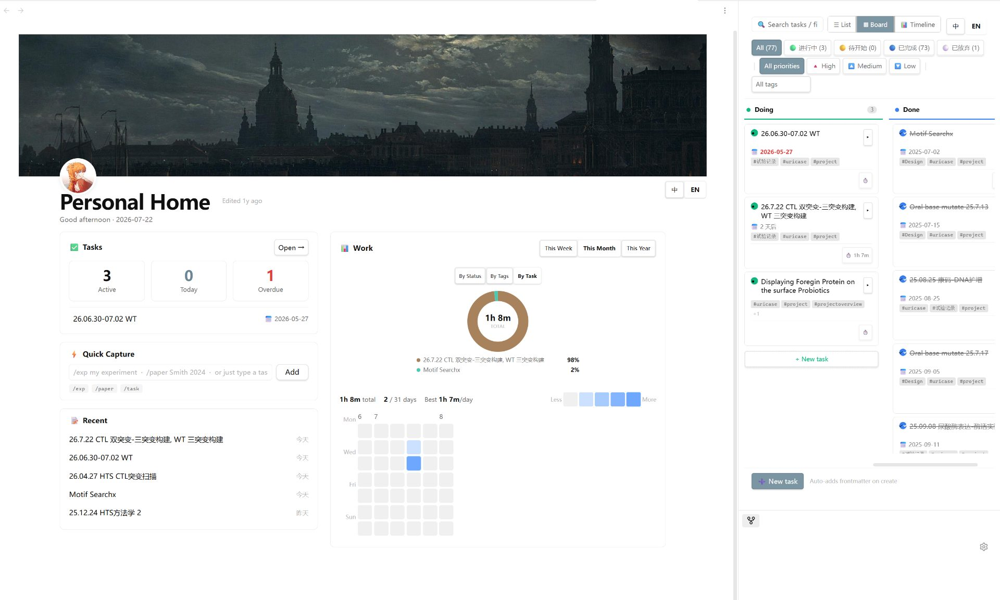

# Notion-style Home & Tasks

一个 Notion 风格的 Obsidian 插件：Home 主页 + 轻量级任务管理。每个任务就是一个 `.md` 文件，元数据写在 frontmatter，计时自动写回文件。

> [English](README.md) · 当前版本 v0.7.0



---

## ✨ 功能

### 🏠 Notion 风格 Home 主页

- **顶部 banner + 左下圆形 avatar**（硬切，不渐变）
- **大标题 + 工具栏**（Share / Star / More 在左）
- **双栏布局**：
  - 左栏：任务摘要 / 快速创建 / 最近编辑
  - 右栏：工作时间（扇形图 + 热力图）
- **语言切换**（中文 / English）在标题区，一处切换全插件生效
- **背景可定制**：渐变色 / 本机图片 / vault 内图片

### ✅ 任务管理（3 种视图，一键切换）

- **列表视图** — 紧凑勾选行，行内直接编辑 tag / 优先级 / 日期，hover 弹出计时按钮
- **看板视图** — 4 列按状态分组，**拖拽卡片改状态**，行内展开 sub-task
- **时间线视图** — 按文件分组的 bar 图，**默认滚动到今天**，行内 sub-task 抽屉
- **4 状态模型**：`Doing` / `Prepare` / `Done` / `Abandon`（颜色编码）
- **任务计时** — 任何视图都能启停，实时显示，写入 `Time Tracking` + `Last Timer Start`
- **时间微调** — `+15m / +30m / +1h / +2h` 快捷调整、自定义输入、清零
- **Sub-task 展开** — 任意任务可展开/收起，行内勾选 `- [ ]` 写入文件
- **过滤** — 按状态、优先级、tag 或全文搜索

### 📊 工作时间统计

- **热力图** — 按天统计，**本周 / 本月 / 本年** 三档切换
- **扇形图** — 按 **状态** / **tags**（多 tag 任务时长均分）/ **任务** 分组
- **localStorage 备份** — 计时数据防丢（Obsidian 异常关闭也能恢复）

### 📁 Quick Capture 模板

- `/exp <名称>` → 建实验记录，自带结构化模板
- `/paper <标题>` → 建论文阅读笔记
- `/task <名称>` → 普通任务
- 每种模板自动用对应的默认文件夹（`Experiments/` / `Papers/`），设置里可改

### 🌍 多语言

- 全插件 **中文 / English** UI（Home、Tasks、Settings）
- Home 和 Tasks 视图都有切换按钮
- 切换一次，全插件立即生效

---

## 📦 安装

### 方式 1：BRAT（推荐，适合尝鲜）

1. 在「第三方插件」装 [BRAT](https://github.com/TfTHacker/obsidian42-brat)
2. 打开 BRAT 设置 → "Add Beta plugin"
3. 输入：`suxin17/notion-home-plugin`
4. 点 Add Plugin —— 完成，后续更新自动装

### 方式 2：手动装

1. 去 [Releases](https://github.com/suxin17/notion-home-plugin/releases) 下载最新版的 `main.js` / `manifest.json` / `styles.css`
2. 在 vault 里建文件夹：`.obsidian/plugins/notion-home-plugin/`
3. 把三个文件丢进去
4. Obsidian → 设置 → 第三方插件 → 启用 **Notion-style Home & Tasks**

### 方式 3：社区插件商店

_（待提交：[obsidianmd/obsidian-releases](https://github.com/obsidianmd/obsidian-releases) PR 中）_

---

## 🚀 快速开始

1. 装好后在 ribbon（侧边图标栏）点 🏠 图标，或运行命令 "Open Home" 打开 Home 视图
2. 在 **设置 → Notion-style Home & Tasks → Options** 调外观：
   - 选背景（渐变 / 图片）
   - 换头像（emoji / 本机图片 / vault 图片）
   - 设置实验 / 论文 / 任务的默认文件夹
3. 开始计时：打开 **Tasks** 视图 → 点任意任务行的 ▶ 按钮
4. 用 Quick Capture 建任务：
   - Home 里输入 `/exp 跑一组对照实验` → 回车
   - Tasks 里点 ➕ 新建任务，输入带前缀的名字

---

## 📝 任务数据格式

每个任务 = 一个 `.md` 文件，frontmatter 存元数据：

```yaml
---
tafs: [work, design]                  # tag 列表（也读 Obsidian 标准 #tag）
Status: Doing                          # Doing | Prepare | Done | Abandon
Start Date: 2026-07-21                # 开始日期
Completion Date: 2026-07-25           # 截止日期
Priority: high                        # high | medium | low | none
Time Tracking: 1h 30m                 # 累计计时（插件自动写）
Last Timer Start: 2026-07-21 14:30    # 正在计时标记
---
```

### 状态颜色

| 状态 | 中文 | 颜色 | 用途 |
|---|---|---|---|
| `Doing` | 进行中 | 🟢 绿 | 当前正在做 |
| `Prepare` | 待开始 | 🟡 琥珀 | 计划好了但还没开始 |
| `Done` | 已完成 | 🔵 蓝 | 已完成 |
| `Abandon` | 已放弃 | ⚪ 灰 | 不做了 |

---

## 🛠 开发

```powershell
# 装依赖
npm install

# 类型检查
npx tsc --noEmit

# 构建（产出 main.js + styles.css）
npm run build

# 复制到 vault 本地测试
$dest = "E:\OneDrive\Obsidian\.obsidian\plugins\notion-home-plugin"
Copy-Item main.js, styles.css, manifest.json -Destination $dest -Force
```

### 发版流程（GitHub Actions 自动）

1. 改 `manifest.json` 里的 `version` + 在 `versions.json` 加条目
2. 提交 + 打 tag + 推送：

```bash
git add .
git commit -m "Release v0.x.y: ..."
git tag 0.x.y
git push origin main --tags
```

3. GitHub Actions 自动：
   - 校验 `manifest.json` 和 `versions.json` 一致
   - 跑 `npm ci` + 类型检查 + build
   - 在 GitHub Releases 创建对应版本，附带 `main.js` / `manifest.json` / `styles.css`

---

## 🗺 更新日志

### v0.7.0（当前）

**新增**
- **Sub-task 列表** — List / Board / Gantt 三个视图都能展开/收起，行内勾选 checkbox 写回文件
- **看板拖拽改状态** — 卡片拖到别的列 = 改状态
- **多 tag 时长均分** — 扇形图按 tags 时，一个任务的多个 tag 各分到 1/N
- **统计周期 tab** — 热力图和扇形图都支持本周/本月/本年切换
- **甘特图时间范围 tab** — week/month/year，默认居中今天
- **Quick Capture 模板** — Home 和 Tasks 里的 `/exp` / `/paper` / `/task` 前缀
- **中英文切换** — Home 和 Tasks 都有切换按钮
- **Home 自适应宽度** — 最大 1400px，< 720px 自动单列
- **Pie chart 分组切换** — 状态 / tags / 任务，inline 在 Home
- **Notion 风调色板** — 16 色柔和、识别度高
- **Tag 读取三源合并** — 插件 `tafs` + Obsidian 标准 `tags` + body 内联 `#tag`

**修复**
- Avatar 不再被 banner 的 `overflow: hidden` 裁掉（改用独立 clip 层）
- 扇形图/热力图统计周期统一由 `StatRange` 驱动
- 甘特图时间范围完全由 `StatRange` 驱动（不再根据任务自动算）

### v0.6.0
- 每个任务行加计时按钮（3 种变体：button / chip / compact）
- timeLog localStorage 兜底
- 时间微调：`+15m / +30m / +1h / +2h` 快捷、自定义、清零

### v0.5.0
- Notion Personal Home 风格：banner + avatar + 大标题 + 双栏
- 4 状态 frontmatter 模式
- 自定义背景：渐变 / 本机图片 / vault 图片
- 多语言问候语

### v0.4.0
- 工作时间热力图（自适应宽度，4 调色板）
- 扇形图（SVG 圆环，从 timeLog 实时聚合）
- 行内状态 / 优先级 / 日期 / tag 编辑器
- StatusCircle（16px Notion checkbox 风格）

### v0.3.0
- Frontmatter 模式任务模型
- 行内 tag / 优先级 / 日期编辑器

### v0.2.0
- 任务计时（开始 / 停止 / 累加）
- 工作时间热力图

### v0.1.0
- Notion 风格 Home 主页（基础版）
- 任务面板：列表 + 甘特图
- 基础计时（无累加）

---

## 📄 协议

[MIT](LICENSE) © 2026 suxin17
